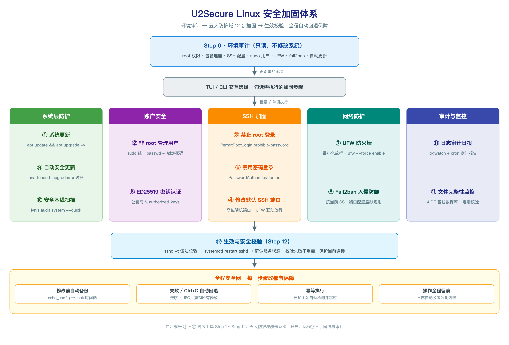

<div align="center">

<h1>U2Secure</h1>
<h3>Linux 服务器安全加固工具 — CLI / TUI 双模式</h3>
<p>
  <a href="https://github.com/cherish-ltt/u2secure/actions/workflows/rust-ci.yml">
    
  </a>
  <a href="https://crates.io/crates/u2secure">
    
  </a>
  <a href="https://docs.rs/u2secure">
    
  </a>
  <a href="https://github.com/cherish-ltt/u2secure/blob/main/LICENSE">
    
  </a>
  <a href="https://www.rust-lang.org">
    
  </a>
  
</p>
</div>

> 🚀 面向 Linux 运维人员的交互式安全加固工具。支持 **TUI 终端图形界面**与**传统 CLI** 双模式。运行一次即可完成从系统更新、用户创建、SSH 深度加固、防火墙、入侵防御、审计到自动更新的完整安全基线建设。

## 目录

- [概述](#概述)
- [安全加固体系](#安全加固体系)
- [快速开始](#快速开始)
- [启动模式](#启动模式)
- [TUI 界面](#tui-界面)
- [功能详解](#功能详解)
  - [Step 0：环境审计](#step-0环境审计)
  - [Step 1 ~ Step 12：加固步骤](#step-1--step-12加固步骤)
- [安全回退机制](#安全回退机制)
- [常见问题](#常见问题)
- [贡献指南](#贡献指南)
- [版本历史](#版本历史)

---

## 概述

### 设计目标

- 首次运行自动审计系统当前安全状态，对已加固项目标记"安全可靠"（**幂等**）
- **TUI 模式**：ratatui 终端图形界面，步骤列表 + 日志面板 + 进度条，支持单项强制执行
- **CLI 模式**：传统 dialoguer 向导式交互，兼容原版体验
- 每步执行前检测状态，不重复配置
- 所有系统修改前自动备份，Ctrl+C 中断或步骤失败时自动回退

### 适用范围

| 项目 | 支持情况 |
|------|---------|
| 发行版 | Debian/Ubuntu（首选），兼容 RHEL/CentOS（yum/dnf） |
| 权限 | **必须以 root 运行**，审计阶段只读不写 |
| 内核 | Linux 3.10+ |
| SSH 服务 | OpenSSH（sshd） |
| 防火墙 | UFW（首选），检测到 firewalld 时提示适配 |

### 项目结构

```
src/
├── main.rs                 # 入口：三级路由 → CLI / TUI / 交互选择
├── domain/                 # 领域层（零外部依赖）
│   ├── audit.rs            # AuditReport（全项目唯一状态真值）、AuditStatus、PackageManager
│   ├── steps.rs            # StepKind、HardeningStep trait、ExecuteParams、StepResult/StepOutcome
│   ├── mirror.rs           # PackageMirror（临时软件源值对象）
│   ├── errors.rs           # DomainError
│   └── undo.rs             # UndoAction（可撤销操作值对象）
├── application/            # 应用层
│   ├── orchestrator.rs     # HardeningOrchestrator（审计与依赖装配）
│   ├── job.rs              # StepRunner：统一执行策略 + 后台线程 + 事件流
│   └── steps.rs            # 12 个步骤的具体实现
├── infrastructure/         # 基础设施
│   ├── system.rs           # 系统命令、流式执行（超时/取消）、配置解析、用户与密钥管理
│   ├── artifacts.rs        # 报告目录（扫描产物持久化）
│   ├── package_mirror.rs   # 临时软件源：主机改写 / 延迟探测 / apt -o 覆盖
│   ├── lynis.rs            # lynis-report.dat 解析
│   ├── aide.rs             # aide 配置探测/兜底生成、数据库初始化与验证
│   ├── logger.rs           # 日志记录（含公钥脱敏）
│   └── rollback.rs         # 回退管理器：undo 栈 + Ctrl+C 信号处理
└── presentation/           # 表示层
    ├── cli.rs              # dialoguer 交互式 CLI
    └── tui.rs              # ratatui 终端图形界面（TUI）
```

---

## 安全加固体系

U2Secure 通过**环境审计 → 五大防护域 12 步加固 → 生效校验**的完整流程系统性提升 Linux 服务器的安全基线，每一步修改都受"全程安全网"（自动备份 / 自动回退 / 幂等执行 / 日志脱敏）保护：



---

## 快速开始

### 安装

> **推荐使用 npm / bun 或 cargo-binstall 安装**：自动根据当前架构（Linux x86_64 / ARM64）下载预编译二进制，无需本地 Rust 环境。
>
> **仅支持 Linux**：U2Secure 依赖 apt/dnf、ufw、sshd、systemd 与 `/var/log` 等 Linux 专有组件，
> 只发布 Linux 二进制；在 macOS/Windows 上请通过 Docker 或 Linux 服务器/虚拟机使用。

#### 方式一：npm / bun（推荐）

```bash
# npm 全局安装
npm install -g @ghyper9023/u2secure

# 或 bun 全局安装
bun install -g @ghyper9023/u2secure
```

安装时 postinstall 脚本自动从 GitHub Releases 下载当前平台的预编译二进制，完成后直接运行 `sudo u2secure`。bun 默认拦截 postinstall 脚本，首次安装时按提示信任该包即可。

#### 方式二：cargo-binstall

```bash
cargo binstall u2secure
```

通过 [cargo-binstall](https://github.com/cargo-bins/cargo-binstall) 直接安装 GitHub Releases 中的预编译二进制，跳过本地编译。

#### 方式三：crates.io 源码安装

```bash
cargo install u2secure --locked
```

#### 方式四：从源码编译

```bash
git clone <repo-url> u2secure
cd u2secure
cargo build --release

# 二进制位于 target/release/u2secure
sudo cp target/release/u2secure /usr/local/bin/
```

### 运行

```bash
sudo u2secure           # 交互式选择启动模式
sudo u2secure -t        # 直接启动 TUI 模式（推荐）
sudo u2secure -c        # 直接启动 CLI 模式
```

## 启动模式

| 命令 | 模式 | 说明 |
|------|------|------|
| `u2secure` | 交互选择 | 弹窗选择 CLI 或 TUI |
| `u2secure -t` / `--tui` | **TUI** | ratatui 终端图形界面（默认推荐） |
| `u2secure -c` / `--cli` | **CLI** | 传统 dialoguer 交互式向导 |

## TUI 界面

```
┌─ U2Secure v0.4.0 — Linux 服务器安全加固工具 ──────────┐
├─ 审计报告 ────────────────────────────────────────────┤
│ ✅root ❌SSH:22 ❌sudo用户 ❌UFW ❌fail2ban ...       │
├──────────────────────┬────────────────────────────────┤
│  📋 加固步骤 (12)    │  ⚙️ 操作提示 / 执行状态        │
│                      │                                │
│  ▸ [✓] 系统更新  ✅  │  ↑↓ 移动光标                  │
│    [✓] 用户创建  ❌  │  Space 切换选择               │
│    [ ] SSH root  ✅  │  Enter 批量执行（后台线程）    │
│    [ ] 安全扫描（可选·耗时）❌ │  e 单项执行           │
│    ...               │  ⠹ 3/12 已耗时 01:23          │
├──────────────────────┴────────────────────────────────┤
│  ↑↓/jk Space a Enter e r q   |   执行中 Ctrl+C 中断    │
└──────────────────────────────────────────────────────┘
```

### TUI 操作键

| 按键 | 功能 |
|------|------|
| `↑` / `↓` | 移动步骤光标 |
| `Space` | 切换选中/取消 |
| `a` | 全选 / 取消全选（可选步骤 9/10/11 除外，需手动勾选） |
| `Enter` | 批量执行所有勾选步骤（**后台线程执行，界面不阻塞**） |
| `e` | **立即执行当前步骤**（不依赖勾选状态） |
| `r` | 重新执行环境审计 |
| `Ctrl+C` | 执行中：中断当前命令 → 回滚已注册修改 → 停止后续步骤 |
| `q` | 退出（执行中不可用，需先 `Ctrl+C`） |
| `↑` / `↓`（结果页） | 滚动查看完整结果 |

> **执行期间界面保持响应**：显示当前步骤、进度、已耗时、实时命令输出尾部。
> 长耗时命令（apt / lynis / aide）均可 `Ctrl+C` 中断，不会"假卡住"。

### TUI 弹窗操作

### TUI 弹窗操作

执行 ED25519 密钥设置时，TUI 会弹出多步对话框：

1. **输入用户名** — 手动输入目标用户名
2. **选择操作** — 生成新密钥 / 粘贴已有公钥 / 跳过
3. **粘贴公钥**（如选择）— 粘贴 ssh-ed25519 或 ssh-rsa 公钥内容

全程在 TUI 内完成，不回退到命令行。

---

## 国际化

支持 **English** / **简体中文** / **繁體中文** 三种语言。启动时自动弹出语言选择：

```bash
sudo u2secure
# → 选择语言 → 选择启动模式 → CLI/TUI
```

也可通过 `-t` / `-c` 参数跳过交互选择，直入对应模式。语言选择器在首次运行 `u2secure` 无参数时出现。

---

## 功能详解

### Step 0：环境审计

运行任何修改前，工具会**只读**扫描系统，输出"当前安全状态报告"。检测项包括：

| 检测项 | 方式 | 识别结果 |
|--------|------|---------|
| root 权限 | `id -u` | 非 root 禁止执行 |
| 包管理器 | `which apt/yum/dnf` | 确定后续安装命令 |
| SSH 端口 | 解析 `/etc/ssh/sshd_config` 中 `Port` | 非 22 标记"已自定义" |
| 密码登录 | 检查 `PasswordAuthentication` + `ChallengeResponseAuthentication` | 均为 no 标记"已禁用" |
| root 登录 | 检查 `PermitRootLogin` | no/prohibit-password 标记"已禁止" |
| sudo 用户 | `getent group sudo`，过滤 UID≥1000 | 标记已有管理用户列表 |
| fail2ban | `which fail2ban-server` | 标记状态及版本 |
| UFW | `ufw status` | 标记启用状态及规则摘要 |
| 自动更新 | 检查 `unattended-upgrades` 配置或 systemd timer | 标记启用状态 |
| 系统更新 | 检查缓存文件时间戳（7 天内为最新） | 标记"需要更新"或"已最新" |
| lynis（步骤 10） | `which lynis` | 已安装标记"✅"，未安装标记"❌" |
| logwatch / aide（步骤 11） | `which logwatch` / `which aide` | 两者齐备 ✅，仅一项 ⚠️，都没有 ❌ |
| sshd 配置待生效（步骤 12） | 比较 `/etc/ssh/sshd_config` 与 sshd 进程启动时间 | 配置更新则标"🔄 需要重启"，否则 ✅ 并跳过重启 |

### Step 1 ~ Step 12：加固步骤

| 步骤 | 功能 | 幂等检查 | 交互需求 | 回退操作 |
|------|------|---------|---------|---------|
| 1. 系统更新 | `apt update && apt upgrade -y` | 检查缓存是否过期 | 无 | 不可回退（仅记录日志） |
| 2. 非 root 用户创建 | `useradd` + `usermod -aG sudo` + `passwd -l` + 自动生成 ED25519 密钥 | 检查是否有 sudo 用户 | 用户名、是否锁定密码 | `userdel -r <username>` |
| 3. 禁止 root SSH 登录 | `sshd_config` 中 `PermitRootLogin prohibit-password` | 检查当前配置值 | 无 | 从 `.bak` 恢复 |
| 4. SSH 端口修改 | 修改 `Port` 指令，UFW 放行新端口 | 端口是否为 22 | 新端口号 | 恢复备份 + 删除 UFW 规则 |
| 5. 禁止密码登录 | 修改 `PasswordAuthentication` 和 `ChallengeResponseAuthentication` | 检查当前配置值 | **前置条件**：必须有 sudo 用户 | 从 `.bak` 恢复 |
| 6. ED25519 密钥设置 | 生成新密钥对 / 粘贴已有公钥到 `authorized_keys` | 检查 `authorized_keys` 是否存在 | 用户选择 + 密钥内容 | 删除生成的文件 |
| 7. UFW 防火墙配置 | `ufw allow {port}` + `ufw --force enable` | 检查 UFW 是否已启用 | 无 | 删除规则 + 关闭 UFW（如之前未启用） |
| 8. Fail2ban 安装配置 | 安装 fail2ban，配置监狱规则（用当前 SSH 端口） | 检查 `fail2ban-server` 路径 | 无 | `systemctl stop` + `apt remove` |
| 9. 自动安全更新 🕒 | 安装 `unattended-upgrades`，写入 APT 定时配置 | 检查服务或配置文件 | 无 | `systemctl stop` + `apt remove` |
| 10. 安全扫描 🕒 | 安装 lynis（发行版官方源）并执行 `lynis audit system --quick --cronjob`，完整输出落盘 | 检查 `which lynis` | 无 | `apt remove lynis` |
| 11. 日志与审计增强 🕒 | 安装 logwatch + aide（apt 系并装 `aide-common`），生成日志报告，探测并校验 aide 配置后初始化数据库，确保每日完整性检查 | 检查 `which logwatch/aide`、aide 数据库是否已存在 | 无 | `apt remove logwatch aide aide-common` |
| 12. SSH 服务重启 | `sshd -t` 验证语法 → `systemctl restart sshd` → 确认状态 | **配置未变更时直接跳过**（比较配置文件与 sshd 进程启动时间） | 无 | 从 `.bak` 恢复后重启 |

> 🕒 标记的步骤（9/10/11）为**可选步骤**：需要联网安装软件、耗时较长，**默认不勾选**，只有用户主动勾选才会执行。

### 可选步骤（9 / 10 / 11）

| 特性 | 说明 |
|------|------|
| 默认状态 | 一律不勾选；TUI 中显示 `（可选·耗时）` 标记 |
| 失败处理 | **不触发全局回滚**，只记录失败并继续后续步骤（避免"装不上 lynis 就把 SSH 加固全部退回"） |
| 执行方式 | 与其他步骤一样在后台线程执行，界面实时显示进度与命令输出 |
| 超时保护 | 每步命令都有超时上限（apt 15 分钟、lynis 15 分钟、aide 30 分钟），超时自动终止并报告 |
| 结果查看 | 完整输出持久化到报告目录（见下节） |

#### 步骤 2 详解：非 root 用户创建

```bash
# 工具内部实际执行的命令序列：
useradd -m -s /bin/bash deploy          # 创建用户
usermod -aG sudo deploy                 # 加入 sudo 组
passwd -l deploy                        # 锁定密码（强制密钥登录）
ssh-keygen -t ed25519 -f /home/deploy/.ssh/id_ed25519 -N "" -q  # 生成密钥
chmod 600 /home/deploy/.ssh/authorized_keys  # 权限修正
chown -R deploy:deploy /home/deploy/.ssh/
```

#### 步骤 4 详解：SSH 端口修改

```bash
# 工具内部逻辑：
# 1. 读取当前端口（默认 22）
# 2. 随机生成建议端口（1024-65535，避开常见服务端口）
# 3. 用户确认或输入新端口
# 4. 备份 /etc/ssh/sshd_config → /etc/ssh/sshd_config.bak.{时间戳}
# 5. 写入 Port {新端口}
# 6. 如果 UFW 已启用，执行 ufw allow {新端口}
```

#### 步骤 6 详解：ED25519 密钥设置

```bash
# 选项 A：生成新密钥对
ssh-keygen -t ed25519 -f /home/{user}/.ssh/id_ed25519 -N "" -q

# 选项 B：粘贴已有公钥
echo "{公钥内容}" >> /home/{user}/.ssh/authorized_keys
chmod 600 /home/{user}/.ssh/authorized_keys
chown {user}:{user} /home/{user}/.ssh/authorized_keys
```

---

## 扫描结果与日志（持久化）

所有长耗时/扫描类步骤的完整输出都会写入报告目录，界面只展示摘要与路径，
不会因为终端滚动或退出而丢失：

| 目录 | 说明 |
|------|------|
| `/var/log/u2secure/` | 首选报告目录（权限 0700） |
| `./u2secure-reports/` | 首选目录不可写时回退到当前目录 |
| `/var/log/secure-init.log` | 全流程操作日志（不可写时回退到 `./secure-init.log`） |

产物命名：

```
/var/log/u2secure/
├── steps/12-log-audit.log        # 当前步骤的实时命令输出（UI 尾随显示的就是它）
├── mirror-<时间戳>.log            # 临时软件源的 apt update 输出
├── lynis-<时间戳>.log            # lynis 完整扫描输出（人类可读）
├── lynis-<时间戳>.dat            # lynis 机器可读报告（警告/建议/加固指数）
├── logwatch-<日期>.txt           # logwatch 日志审计报告
├── aide-u2secure.conf            # 仅在系统缺少 aide 配置时生成的兜底配置
├── aide-config-check-<时间戳>.log # aide 配置语法校验输出
├── aide-init-<时间戳>.log        # aide 数据库初始化日志
└── aide-check-<日期>.log         # 每日 aide 完整性检查（由定时任务写入）
```

查看方式：

```bash
ls -lh /var/log/u2secure/
less /var/log/u2secure/lynis-<时间戳>.log
```

步骤 10（安全扫描）的结果摘要会直接给出**加固指数、警告数、建议数**与报告路径；
步骤 11 会给出**实际使用的 aide 配置文件路径**、**数据库路径与权限**、
logwatch 报告以及每日检查任务的位置。

### aide 配置与数据库（步骤 11）

Debian/Ubuntu 的 `aide` 包**只安装二进制**，配置文件与 `aideinit` 由 `aide-common`
提供。U2Secure 会自动安装 `aide-common` 并按下述顺序确定配置：

| 顺序 | 来源 | 说明 |
|------|------|------|
| 1 | `aideinit` / `aide.wrapper` 的 `CONFIG=` | Debian 的默认配置，通常是 `/etc/aide/aide.conf` |
| 2 | 发行版标准路径 | apt 为 `/etc/aide/aide.conf`，rpm 系为 `/etc/aide.conf` |
| 3 | 生成兜底配置 | 前两步都不可用时，写入 `/var/log/u2secure/aide-u2secure.conf` |

要点：

- 找到的配置会先用 `aide --config-check` **只读校验**，语法有问题才回退到兜底配置；
- 兜底配置只使用各版本通用的配置项（不依赖发行版 `aide.conf.d`），
  数据库使用独立文件名 `aide-u2secure.db`，**不会覆盖系统既有的 `aide.db` 基线**；
- 若目标路径已存在**非本工具生成**的文件，则改写入带时间戳的新文件，绝不覆盖用户配置；
- 初始化后立即执行一次 `aide --check` 验证可用（退出码 1–7 表示"发现文件差异"，属正常结果，
  ≥14 才是执行错误），数据库权限收紧为 0600；
- 已存在数据库时不重新初始化，保留既有基线。

### 每日定时任务

| 任务 | 写入位置 | 条件 |
|------|---------|------|
| logwatch 每日报告 | `/etc/cron.daily/99u2secure-logwatch` → `logwatch-<日期>.txt` | 仅当系统没有发行版自带的 `/etc/cron.daily/00logwatch` 时创建（不覆盖发行版文件） |
| aide 每日完整性检查 | `/etc/cron.daily/99u2secure-aide` → `aide-check-<日期>.log` | 仅当系统没有 `cron.daily/aide`、`cron.daily/dailyaidecheck` 或 `dailyaidecheck.timer` 时创建 |

aide 每日脚本会显式带上步骤 11 探测到的 `--config`，并按 AIDE 的退出码语义判读结果：
`1–7` 表示检测到文件差异（正常结果，退出 0），`≥14` 才是执行错误（非零退出并写入日志）。

---

## 临时软件源（加速下载）

面向国内服务器：运行前可选择使用镜像源加速软件包下载，**只对本次运行生效，不修改系统任何文件**。

| 选项 | 说明 |
|------|------|
| 原始软件源 | 不做任何改动（默认） |
| 清华大学 TUNA 镜像 | 探测 `mirrors.tuna.tsinghua.edu.cn:443` 延迟并显示 |
| 中国科学技术大学镜像 | 探测 `mirrors.ustc.edu.cn:443` 延迟并显示 |
| 自定义输入源 | 手动输入主机名或完整地址（如 `mirrors.aliyun.com`、`https://mirrors.huaweicloud.com/ubuntu`），只取主机名，路径沿用系统原有源 |

实现方式（非侵入）：

- **apt**：把改写后的源写入临时目录，通过
  `apt -o Dir::Etc::sourcelist=<临时文件> -o Dir::Etc::sourceparts=<临时目录> -o APT::Get::List-Cleanup=0`
  覆盖本次调用的源列表，`/etc/apt/sources.list*` 完全不动。
- **dnf/yum**：复制并改写 `baseurl` 主机到临时目录，通过 `--setopt=reposdir=<临时目录>` 生效。
- 只替换已知上游主机（`archive.ubuntu.com`、`deb.debian.org`、`security.ubuntu.com` 等），
  自建/内网源不会被改动；仅配置了 `mirrorlist` 的 repo 会跳过并在结果中说明。
- 临时目录随运行结束（含中断、异常）自动清理。
- 若镜像预热（`apt update`）失败，自动回退到原始源继续执行，不阻塞流程。

> 只有当本次勾选的步骤会改动软件包（步骤 1/8/9/10/11）时才会弹出选择。

### 连接失败的处理

| 场景 | 行为 |
|------|------|
| 用户取消选择（Esc / 留空自定义输入） | **回退原始软件源**并继续执行 |
| 临时源准备失败（没有可改写的源等） | 记录提示，**回退原始软件源**继续执行 |
| 连接源失败或 **30 秒无任何响应** | **自动重试 3 次**（界面/终端显示每次失败原因），全部失败后**不自动回退**，弹窗交由用户决定 |

失败后的选择（TUI 弹窗 / CLI 菜单一致）：

| 选项 | 说明 |
|------|------|
| 重试 | 沿用当前源重新执行（尚未执行任何步骤，无副作用） |
| 更换源 | 重新选择预设镜像或输入自定义源 |
| 取消执行 | 终止本次运行，未做任何修改 |

超时判定为"连续 30 秒命令没有任何新输出"，避免镜像站挂起时无限等待；每次尝试最长 5 分钟。

---

## 安全回退机制

### 触发条件

| 场景 | 行为 |
|------|------|
| 用户按 `Ctrl+C`（CLI） | 信号处理设置中断标记 → 当前命令被终止 → **逆序执行所有已注册的撤销操作** → 停止后续步骤 |
| 用户按 `Ctrl+C`（TUI） | raw 模式下终端不再产生 SIGINT，因此由界面直接捕获按键 → 置中断标记 → 终止当前子进程 → 回滚 → 停止后续步骤 |
| **核心步骤**执行失败（如 `apt install` 返回非零） | 停止后续步骤 → 自动调用 `undo_all()` → 逆序回退已完成步骤的修改 |
| **可选步骤**（9/10/11）执行失败 | 记录失败结果 → **不回滚**、继续执行后续步骤（可在结果页查看失败原因与日志） |

### 回退过程

回退按 **后进先出（LIFO）** 顺序执行。例如，如果用户依次执行了"创建用户"→"修改 SSH 端口"→"启用 UFW"，回退顺序为：

```
1. 关闭 UFW（如果之前未启用）
2. 删除 UFW 端口放行规则
3. 从备份恢复 sshd_config（撤销端口修改）
4. 删除用户
```

每个回退操作输出到 stderr：

```
  ⮐  恢复 sshd_config（Port）
  ⮐  停止 unattended-upgrades 服务
  ⮐  删除 unattended-upgrades
```

### 备份文件位置

修改 `sshd_config` 前自动备份到 `/etc/ssh/sshd_config.bak.{YYYYMMDDHHMMSS}`。回退时自动恢复备份并清理备份文件。

### 日志

所有操作记录到 `/var/log/secure-init.log`（不可用时 fallback 到 `./secure-init.log`）。日志中公钥内容自动脱敏（仅显示指纹或截断内容）。

---

## 常见问题

### Q：必须以 root 运行吗？

是的。审计阶段会检测 UID，非 root 用户直接退出。大部分操作（安装包、修改 `sshd_config`、管理用户、配置防火墙）均需要 root 权限。

### Q：遇到 `sshd_config 语法错误` 怎么办？

SSH 相关步骤在修改配置后会自动执行 `sshd -t` 验证语法。如验证失败，**不会**重启 SSH 服务，保护当前连接。备份文件位于 `/etc/ssh/sshd_config.bak.*`，可手动恢复：

```bash
# 查找最新备份
ls -t /etc/ssh/sshd_config.bak.* | head -1 | xargs -I{} cp {} /etc/ssh/sshd_config
systemctl restart sshd
```

### Q：密钥生成时提示 `私钥无密码短语保护`？

工具默认生成空密码的 ED25519 密钥（`-N ""`），方便自动化部署。如需密码短语保护：

```bash
ssh-keygen -p -f ~/.ssh/id_ed25519   # 之后设置密码
```

### Q：我手动修改了配置，工具会覆盖吗？

**不会**。每个步骤执行前会检测当前状态。例如 Step 3（禁止 root SSH 登录）检测到 `PermitRootLogin` 已设置为 `no` 或 `prohibit-password` 时，会标记为"✅ 已安全配置"并默认跳过。但用户可以在步骤选择界面**主动勾选**来重新执行覆盖。

### Q：Deiban 以外的发行版支持情况？

| 功能 | Debian/Ubuntu (apt) | RHEL/CentOS (yum/dnf) |
|------|--------------------|-----------------------|
| 系统更新 | ✅ | ✅ |
| 用户创建 | ✅ | ✅（sudo 组名可能需 wheel） |
| SSH 配置 | ✅ | ✅ |
| UFW | ✅ | ❌（检测到 firewalld 会提示） |
| Fail2ban | ✅ | ✅ |
| 自动更新 | ✅（unattended-upgrades） | ❌ |
| Lynis | ✅ | ✅ |

### Q：中断后如何确认系统状态？

```bash
# 查看操作日志
cat /var/log/secure-init.log

# 检查 SSH 配置是否被修改过
diff /etc/ssh/sshd_config /etc/ssh/sshd_config.bak.*

# 检查用户是否被创建
getent group sudo

# 检查 UFW 状态
ufw status
```

## 贡献指南

欢迎提交 Issue 与 Pull Request。所有贡献必须遵守项目开发规范 [AGENTS.md](AGENTS.md)，包括：

- **提交规范**：`<type>: <中文描述>`（如 `feat: 添加用户登录接口`），单次提交对应单一逻辑变更
- **代码质量**：所有变更必须通过 `cargo fmt --check`、`cargo clippy --all-targets -- -D warnings`、`cargo build`、`cargo test` 四项 CI 检查
- **项目结构**：遵循 DDD + 洋葱架构（domain / application / infrastructure / presentation）
- **测试要求**：新功能须附带单元测试，测试覆盖率 ≥ 80%

## 版本历史

| 版本 | 日期 | 亮点 |
|------|------|------|
| [v0.4.1](docs/versions/v0.4.1.md) | 2026-09 | 修复步骤 11 AIDE 数据库初始化失败（退出码 17）：安装 aide-common、探测并校验配置、生成不覆盖基线的兜底配置；发布流水线改为二进制构建成功后再发包；构建目标收敛为 Linux x86_64/ARM64 |
| [v0.4.0](docs/versions/v0.4.0.md) | 2026-09 | 可选步骤默认关闭、异步执行与实时进度、扫描结果持久化、临时软件源加速（含自定义源与失败重试）、Ctrl+C 中断真正回滚 |
| v0.3.1 | 2026-09 | 许可证变更为 MIT OR Apache-2.0 双协议 |
| v0.3.0 | 2026-09 | 支持 npm / bun / cargo-binstall 安装预编译二进制，新增 Linux & macOS ARM64 构建 |
| [v0.2.0](docs/versions/v0.2.0.md) | 2026-06 | 新增 ratatui TUI 模式，支持单项执行、弹窗交互 |
| v0.1.0 | 2026-05 | 初始版本，dialoguer CLI 交互式加固 |

## 许可证

本项目采用 **MIT OR Apache-2.0** 双许可证开源，你可以任选其一满足许可条款（SPDX: `MIT OR Apache-2.0`）：

- [MIT 许可证](LICENSE) © 2026 u2secure
- [Apache 许可证 2.0](LICENSE-APACHE)

使用时需根据所选许可证保留对应的版权声明和许可声明。


---

<div align="center">
  <sub>Built with ❤️ by the u2secure team</sub>
</div>
